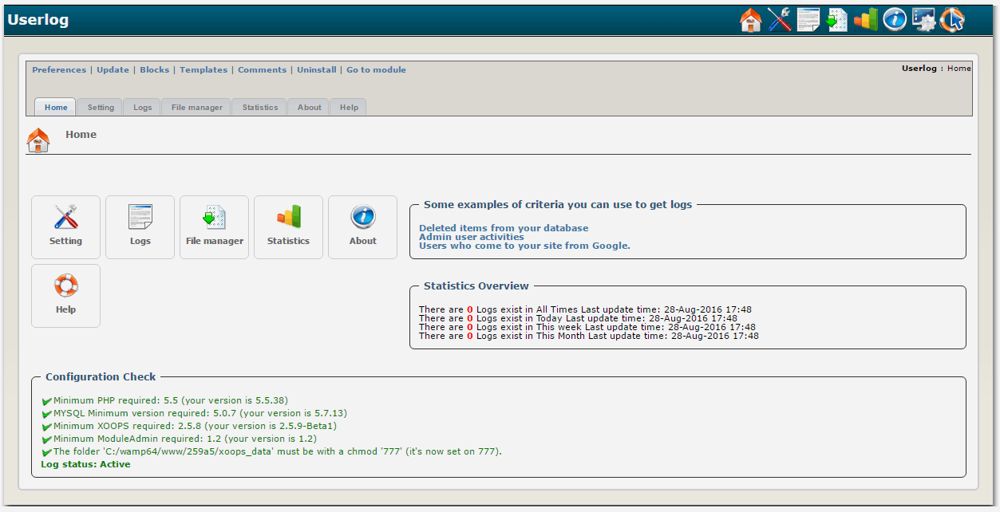

# 2.0 Administration Menu

###Settings

"Setting" provides a wide range of options that you can use to set for specific users to be logged.

**Setting name:** here you can input any name you like. It is not important for the module activities. It is just for you.

**Log by:** here you will choose the 'node' you want to log users by, and in the next part you should input the Unique ID for this node. Currently you can log users by "user id", "user group" and "visitor IP".

- by selecting uid only that specific user will be logged. eg uid=1

- by selecting user group all activities of users belong to that specific group will be logged. eg: gid=3

- visitor IP is very useful to log robots, malicious visitors and ... eg: ip=66.249.66.1

- if you set Unique id = 0 (read the next part) Userlog module will log all users/visitors regardless of logby.

Log user activities by fetching this value from users table in database? priority: IF exist uid log it ELSEIF exist gid log it ELSEIf exist ip log it ELSE if Unique id = 0 log all users ELSE don't log

**Unique ID:** here you must choose one unique ID (node id) to be logged.

Unique ID, e.g.: uid=1, gid=3 (anonymous), ip=66.249.66.1, 0=all users

**Options:** you can select which user or page data you want to be logged. Also here you can choose 7 settings:

Setting is active?, Log visitors come from inside your site?, Log visitors come from outside your site?, Do not log passwords?, Store logs in file?, Store logs in database?, Log user views?,

Log which user/page data? Notice: selecting no option means all options. Selecting no store option (File and/or Database) means Database. Selecting views means store uid, groups, script name, pagetitle, pageadmin, module dirname, module name, item name, item id in Database

**Log scope:** if you want to log users activities in some specific module, you can do it here.
select nothing means all website.

> Attention: we assume you will not have many settings in your site (eg: less than 100 settings) so we don't provide many navigation facilities like order and sort in set list table. You just have a page navigation.

> Advise: more settings will only confuse you more. Choose logby and Unique ID wisely to avoid any overlap.

For example for a specific user use "uid" but for a group use "gid".

###Logs

You can see/delete/purge/export users logs through the Admin section of the userlog Module.

You can get logs from database or file source engine.

To search for logs based on a criteria you have an advance form.

Export files will be stored in "the working path"/export folder.

###File manager

You can see/delete/rename/copy/merge/compress(zip)/export users log files through the file manager of the userlog Module.

Zip files will be stored in "the working path"/zip folder.

Export files will be stored in "the working path"/export folder.

You can select a name for your result (e.g.: copied file) but if you leave that empty, userlog will generate an automatic name by using the current criteria and date.

The difference between The file manager section and logs section when you select file engine is, in logs section you dynamically work with files data and can see them rows by rows in detail but in file manager you just can work on the whole data in files.

For example in logs section you can select some rows to export but in file manager you just can export whole data from some selected files.

> Attention: If you work on too many files at once you may end up a white screen. It is because the server runs out of memory and/or cpu.

###Statistics

You can see total module views, total user views, total group views through the Statistics of the userlog Module.

You also can see all Referrals, Browsers and Operating systems.

There is a new login/register history which you can see all attempts by anonymous users (failed and successive) to login or register in your website.

To start a login/register history, you should add a setting for anonymous users (Group id = 3) or all users (Unique ID = 0) which log at least uid and $_POST.(See above how to add a setting)

Also you have an advance form to see any item views using some criteria like what is the module/link/log time/viewer uid/viewer group id of the item

Statistics is under develop. please let us know what do you like to see here.

###Userlog > Blocks

**All views in site**

Many XOOPS users have a wish for a block to see most viewed items in a module or in the whole website in a specific period of time.

For example in news module we just have a most viewed block that shows forever views.

Now with Userlog module this wish is completely addressed. You have many options in this block. Check it out yourself and play with it to see more.

**Login/Register History**

failed | successful

**Types to get stats**

Referrals | Browser | Operating System
