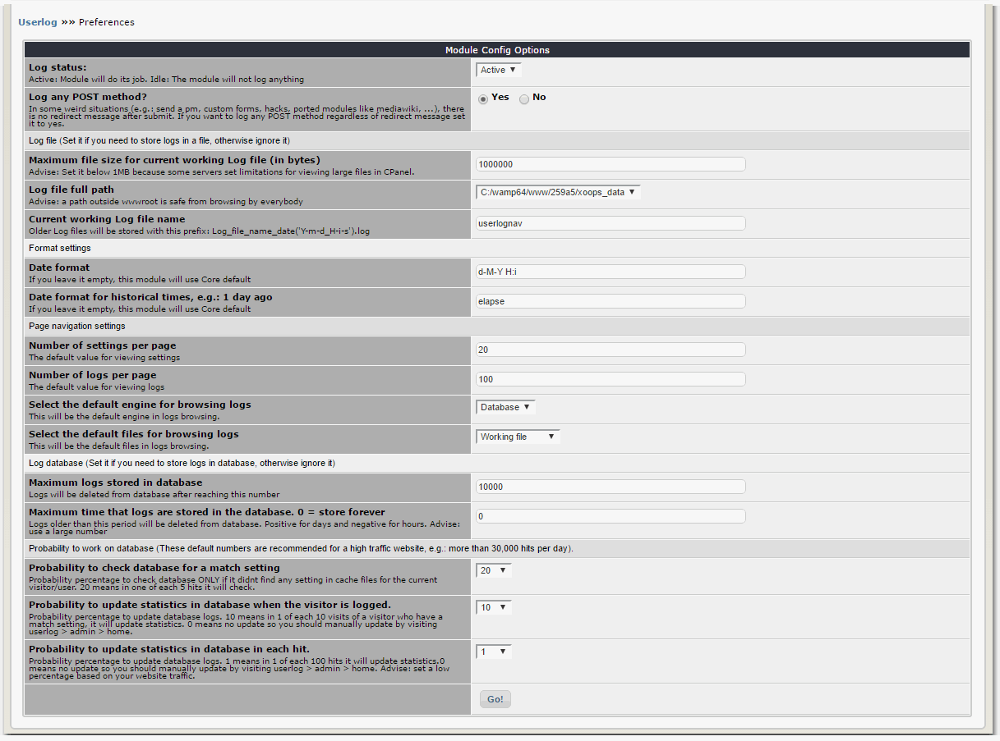

# 3.0 Preferences

Here you can set your desired values for important configuration items.

**Important configs are:**

* **Log file settings**: If you need to store logs in a file, set the working path, working file size, and working file name here 

* **Log database settings**: If you need to store logs in database, set the maximum logs thresholds here.

* **Log any POST method?**: In some weird situations (e.g.: send a PM, custom forms, hacks, ported modules like mediawiki, ...), there is no redirect message after submit. If you want to log any POST method regardless of redirect message set it to yes.
