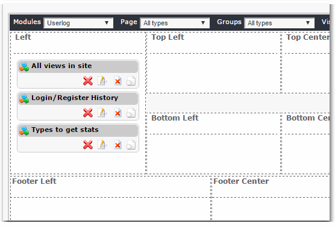
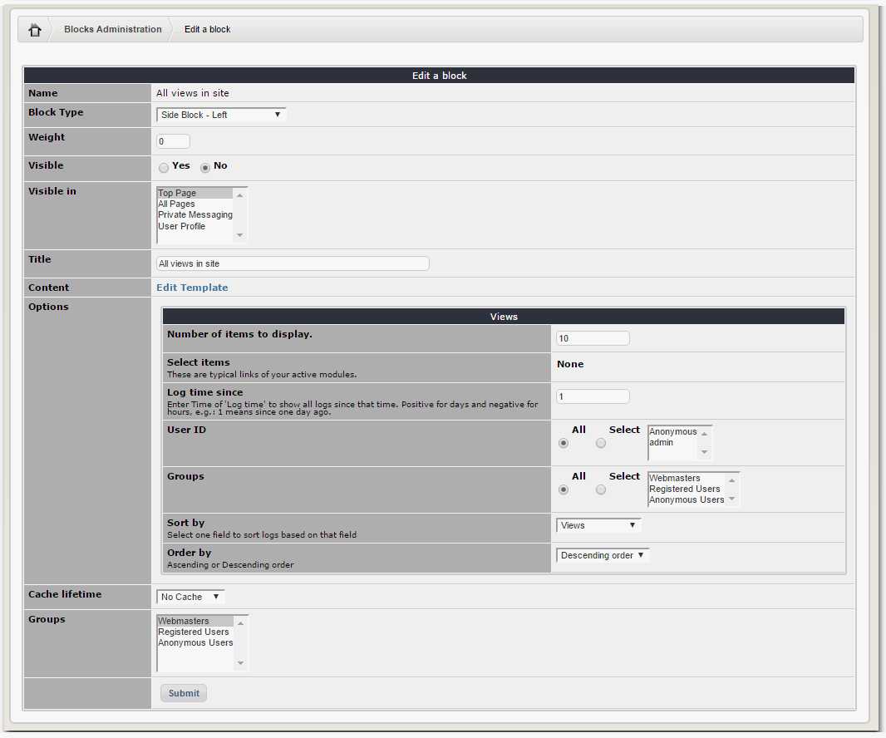
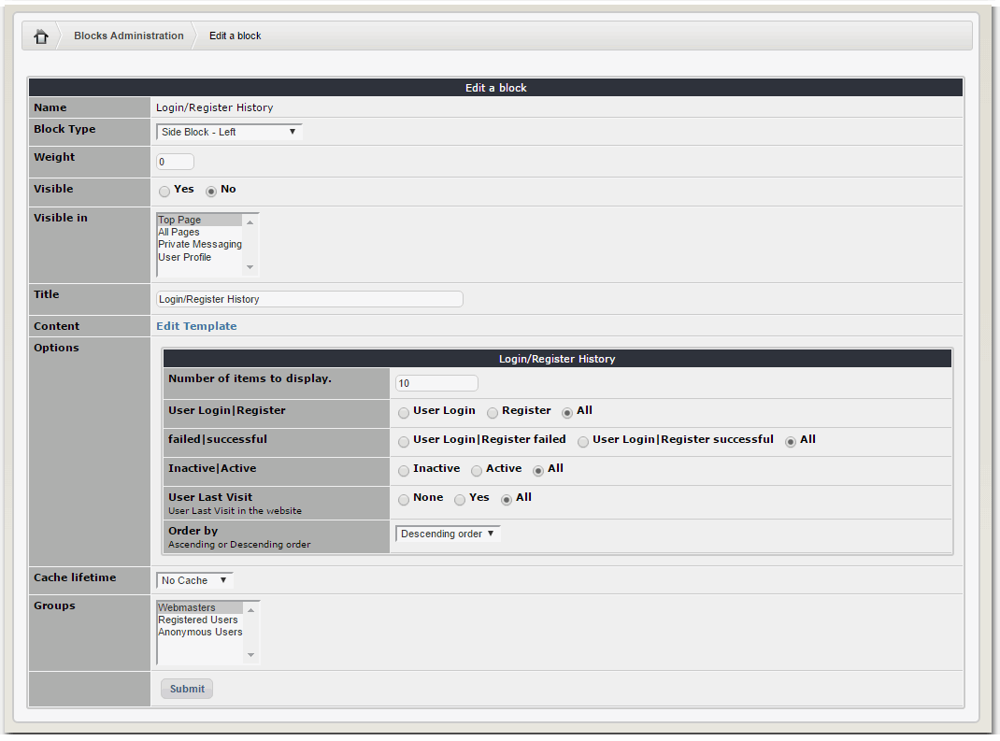
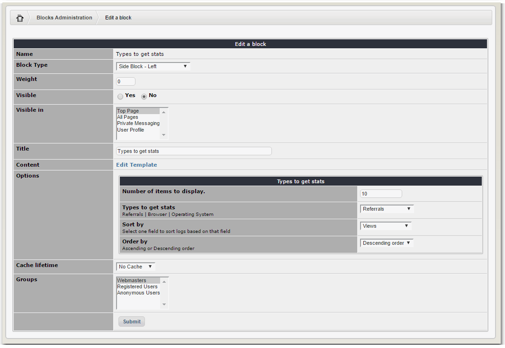

# 6.0 Blocks

Userlog provides three Blocks:

**All views in site**

Many XOOPS users have a wish for a block to see most viewed items in a module or in the whole website in a specific period of time.

For example in news module we just have a most viewed block that shows forever views.

Now with Userlog module this wish is completely addressed. You have many options in this block. Check it out yourself and play with it to see more.

**Login/Register History**

failed | successful

**Types to get stats**

Referrals | Browser | Operating System
